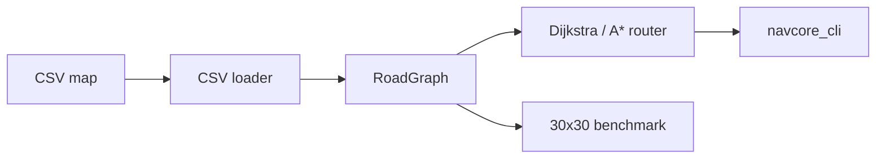

# NavCore

NavCore 是一个教学用途的 C++17 轻量道路图导航与路径规划引擎，不是生产导航系统。



## 数据模型

`Node` 包含 ID、纬度和经度。`Edge` 包含起终点、`length_m`、`speed_limit_kph`、`travel_time_s`、道路等级与单行标记。`RoadGraph` 以邻接表存储道路；双向边自动加入反向邻接关系。`RouteResult` 输出节点/边路径、总距离、ETA、扩展节点数和运行时间。

CSV 每行是 `N,id,latitude,longitude` 或 `E,from,to,length_m,speed_limit_kph,travel_time_s,road_class,one_way`。加载器会拒绝重复节点、缺失引用、非法距离/速度/时间、非法布尔值和格式错误行。

## 算法

Dijkstra 对非负边权求最短路，二叉堆复杂度为 `O((V+E) log V)`。A* 使用从当前图的实际边数据推导的全局下界：对每条边计算“优化成本 / Haversine 距离”的最小比值，再以该比值乘以节点到终点的 Haversine 距离。由地理三角不等式，这对距离和时间目标均可采纳；若图没有可推导的地理边，启发式安全退化为 0。它不假设固定最高速度，也不假设 CSV 中的边长大于 Haversine 距离。最坏复杂度与 Dijkstra 相同，但通常扩展更少节点。

## 构建与运行

```sh
cmake -S . -B build -G Ninja -DCMAKE_CXX_COMPILER=clang++
cmake --build build
ctest --test-dir build --output-on-failure
./build/navcore_cli --map data/sample_map.csv --from A --to F --algo astar --cost time
./build/navcore_benchmark
```

CLI 输出路径、总距离、ETA、访问节点与运行时间。可传入 `--avoid motorway` 避开道路等级，或 `--block A->D` 封闭边。

## 测试、基准与 CI

CT​​est 覆盖最短距离、最快路线、Dijkstra/A* 一致性、单行/不可达、封路、避开 motorway、重复节点、无效边和起点等于终点。基准生成 30x30（900 节点）网格并写入 `reports/benchmark.csv` 与 Markdown 摘要。GitHub Actions 在 Ubuntu 以 Clang C++17、warnings-as-errors 执行构建、CTest 与 CLI 冒烟测试。
